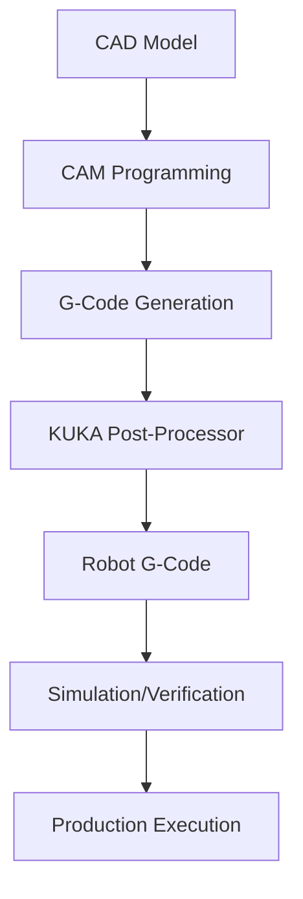

# KUKA Robot to CNC Integration: From KRL to G-Code Programming

## Table of Contents
1. [Understanding the Integration Landscape](#understanding-the-integration-landscape)
2. [KUKA Robot Language (KRL) Fundamentals](#kuka-robot-language-krl-fundamentals)
3. [CNC Integration Methods](#cnc-integration-methods)
4. [KUKA.CNC Technology Deep Dive](#kukacnc-technology-deep-dive)
5. [Practical Implementation Steps](#practical-implementation-steps)
6. [Code Examples and Programming Techniques](#code-examples-and-programming-techniques)
7. [CAM Software Integration](#cam-software-integration)
8. [Troubleshooting and Optimization](#troubleshooting-and-optimization)
9. [Cost Analysis and ROI](#cost-analysis-and-roi)

---

## Understanding the Integration Landscape

### The Engineering Challenge
If you're an engineer with CNC machining experience looking at KUKA robots, you're facing a fundamental question: "How do I leverage my existing G-code and CAM knowledge with KUKA's robot programming language (KRL)?"

The answer lies in understanding three distinct integration approaches:
1. **Direct Translation**: Convert G-code to KRL commands
2. **KUKA.CNC Integration**: Enable direct G-code execution on KUKA controllers
3. **Hybrid Programming**: Combine KRL robot logic with CNC-style motion commands

### Why This Matters for Your Business
- **Leverage Existing Skills**: Your CNC programming team can transition faster
- **Reuse CAM Programs**: Existing toolpaths can be adapted for robot applications
- **Faster Implementation**: Reduced learning curve means quicker ROI
- **Precision Control**: CNC-level accuracy for robotic applications

---

## KUKA Robot Language (KRL) Fundamentals

### KRL in Context: What CNC Programmers Need to Know

Think of KRL as the "machine code" of KUKA robots, similar to how G-code is the foundation of CNC control. However, KRL operates at a higher level, managing not just motion but also:

- **Coordinate Systems**: Base, tool, and work coordinate frames
- **Motion Types**: PTP (point-to-point), LIN (linear), CIRC (circular)
- **I/O Control**: Digital and analog inputs/outputs
- **Safety Systems**: Speed monitoring, workspace limitations
- **Program Flow**: Loops, conditionals, and subroutines

### Basic KRL Structure for CNC Engineers

```krl
DEF MainProgram()
    ; Initialize robot
    BAS(#INITMOV, 0)

    ; Set motion parameters (like feed rates in CNC)
    $VEL.CP = 0.2        ; 20% of maximum velocity
    $ACC.CP = 0.1        ; 10% of maximum acceleration

    ; Move to home position (like G28 in CNC)
    PTP HOME Vel=100 %DEFAULT

    ; Linear movement (like G01 in CNC)
    LIN {X 100, Y 50, Z 200, A 0, B 0, C 0} C_DIS

    ; Circular movement (like G02/G03 in CNC)
    CIRC {X 150, Y 100, Z 200, A 0, B 0, C 0}, {X 200, Y 50, Z 200, A 0, B 0, C 0}

END
```

### Key Differences from G-Code Programming

| G-Code Concept | KRL Equivalent | Key Difference |
|----------------|----------------|----------------|
| G00 (Rapid) | PTP | Joint space movement |
| G01 (Linear) | LIN | Cartesian linear motion |
| G02/G03 (Arc) | CIRC | Requires intermediate point |
| M03/M05 (Spindle) | $OUT[1]=TRUE/FALSE | Digital output control |
| G54-G59 (Work Offsets) | $BASE, $TOOL | Multiple coordinate systems |
| F (Feed Rate) | $VEL.CP | Continuous path velocity |

---

## CNC Integration Methods

### Method 1: Direct G-Code Translation to KRL

**How It Works**: Convert existing G-code programs into equivalent KRL commands using translation software or manual conversion.

**Best For**:
- Simple machining operations
- Existing 2.5D toolpaths
- Quick proof-of-concept implementations

**Example Translation**:
```gcode
; Original G-code
G00 X100 Y50 Z200    ; Rapid to position
G01 X150 F500        ; Linear feed move
G02 X200 Y100 I25 J0 F500  ; Clockwise arc
```

```krl
; Equivalent KRL
PTP {X 100, Y 50, Z 200, A 0, B 0, C 0} Vel=100 %DEFAULT
LIN {X 150, Y 50, Z 200, A 0, B 0, C 0} C_DIS
CIRC {X 175, Y 75, Z 200, A 0, B 0, C 0}, {X 200, Y 100, Z 200, A 0, B 0, C 0} C_DIS
```

**Limitations**:
- Manual translation is time-consuming
- Complex geometries require significant adaptation
- Tool orientation control needs additional programming

### Method 2: KUKA.CNC Direct Integration

**How It Works**: KUKA.CNC technology enables direct execution of ISO 6983 G-code on KUKA controllers without translation to KRL.

**Technical Implementation**:
```krl
; KUKA.CNC program structure
DEF CNC_Program()
    ; Initialize CNC mode
    CNC_INIT()

    ; Load G-code program
    CNC_LOAD("PART_001.NC")

    ; Execute CNC program
    CNC_START()

    ; Monitor execution
    REPEAT
        WAIT FOR CNC_READY()
    UNTIL CNC_FINISHED()

END
```

**Advantages**:
- Direct G-code execution (ISO 6983 compatible)
- CAM software integration
- Tool radius compensation
- Canned cycles support
- Sister tool management

**Requirements**:
- KUKA KRC4 or KRC5 controller
- KUKA.CNC software license (€10,000-25,000)
- Compatible robot models (KR series)

### Method 3: Hybrid Programming Approach

**How It Works**: Combine KRL robot-specific logic with CNC-style motion commands for optimal flexibility.

```krl
DEF HybridWelding()
    ; Robot-specific initialization
    BAS(#INITMOV, 0)
    InitializeWeldingTorch()

    ; CNC-style motion for precision path
    ExecuteGCodeSequence("WELD_PATH_001.NC")

    ; Robot logic for process control
    IF WeldQualityOK() THEN
        MoveToNextPosition()
    ELSE
        ExecuteReworkSequence()
    ENDIF

END

DEF ExecuteGCodeSequence(FileName : CHAR[])
    ; Custom function to interpret G-code in KRL
    ; Implementation depends on specific requirements
END
```

---

## KUKA.CNC Technology Deep Dive

### Architecture Overview

KUKA.CNC integrates a complete NC kernel into the KUKA robot controller, enabling:

1. **Direct G-Code Processing**: No conversion to KRL required
2. **Real-Time Execution**: CNC-level timing and precision
3. **CAM Integration**: Direct connection to CAD/CAM systems
4. **Tool Management**: Automatic tool changing and compensation

### System Components

#### NC Kernel Integration
- **Processing**: Direct ISO 6983 G-code interpretation
- **Motion Control**: CNC-style interpolation algorithms
- **Coordinate Systems**: Multiple work coordinate systems (G54-G59)
- **Tool Compensation**: Radius and length compensation

#### Controller Requirements
```krl
; KUKA.CNC system configuration
GLOBAL CHAR G_CODE_PROGRAM[256] = "PART_PROGRAM.NC"
GLOBAL REAL SPINDLE_SPEED = 1000.0
GLOBAL INT TOOL_NUMBER = 1

DEF ConfigureCNC()
    ; Set CNC parameters
    $CNC_FEED_RATE = 500        ; mm/min
    $CNC_SPINDLE_SPEED = 1000   ; rpm
    $CNC_TOOL_NUMBER = 1        ; Active tool

    ; Configure coordinate systems
    $CNC_G54 = {X 0, Y 0, Z 0, A 0, B 0, C 0}
    $CNC_G55 = {X 100, Y 100, Z 0, A 0, B 0, C 0}

END
```

### Supported G-Code Commands

#### Motion Commands
- **G00**: Rapid positioning
- **G01**: Linear interpolation
- **G02/G03**: Circular interpolation (CW/CCW)
- **G04**: Dwell/pause

#### Coordinate System Commands
- **G54-G59**: Work coordinate systems
- **G90/G91**: Absolute/incremental positioning
- **G43**: Tool length compensation

#### Canned Cycles
- **G81**: Drilling cycle
- **G82**: Drilling with dwell
- **G83**: Peck drilling cycle

### Implementation Example: HDPE Cutting Program

```gcode
; G-code program for HDPE septic tank cutting
; Program: TANK_CUTTING.NC

O1000                    ; Program number
G21                      ; Metric programming
G90                      ; Absolute positioning
G54                      ; Work coordinate system
G00 Z50                  ; Rapid to safe height

; Tool call and spindle start
T01 M06                  ; Tool change to cutting tool
S1200 M03                ; Start spindle at 1200 RPM
G00 X0 Y0                ; Position to start point
G00 Z5                   ; Position above work

; Cutting sequence
G01 Z-10 F300            ; Plunge cut
G01 X100 F500            ; Cut along X axis
G02 X150 Y50 I0 J50 F400 ; Arc cut
G01 Y100                 ; Linear cut
G00 Z50                  ; Retract

M05                      ; Stop spindle
M30                      ; Program end
```

**Corresponding KUKA.CNC Implementation**:
```krl
DEF ExecuteTankCutting()
    ; Initialize CNC environment
    CNC_INIT()

    ; Load and verify G-code program
    IF CNC_LOAD("TANK_CUTTING.NC") THEN
        ; Set safety parameters
        $CNC_SAFE_HEIGHT = 50
        $CNC_MAX_FEEDRATE = 1000

        ; Start program execution
        CNC_START()

        ; Monitor execution
        REPEAT
            ; Check for errors or operator intervention
            IF $CNC_ERROR THEN
                HandleCNCError()
                EXIT
            ENDIF

            WAIT FOR $CNC_CYCLE_TIME = 10  ; 10ms cycle

        UNTIL $CNC_PROGRAM_FINISHED

        ; Program completed successfully
        LogProductionData()
    ELSE
        ; Handle program load error
        DisplayError("Failed to load G-code program")
    ENDIF

END
```

---

## Practical Implementation Steps

### Step 1: System Assessment and Planning

#### Hardware Requirements Verification
1. **Controller Compatibility Check**
   ```krl
   ; Check controller version
   IF $ROBNAME[] = "KRC4" OR $ROBNAME[] = "KRC5" THEN
       ; Compatible with KUKA.CNC
       $CNC_CAPABLE = TRUE
   ELSE
       $CNC_CAPABLE = FALSE
       DisplayError("Controller not compatible with KUKA.CNC")
   ENDIF
   ```

2. **Robot Model Verification**
   - KR AGILUS series: Full CNC integration
   - KR CYBERTECH series: CNC with limitations
   - KR FORTEC series: Heavy-duty CNC applications

3. **Software License Planning**
   - KUKA.CNC base license: €10,000-15,000
   - CAM integration package: €5,000-10,000
   - Advanced features (5-axis): €8,000-12,000

### Step 2: CAM Software Configuration

#### Fusion 360 Integration Example
```krl
; Configuration for Fusion 360 post-processor
DEF ConfigureFusion360()
    ; Set KUKA-specific parameters
    $CAM_SYSTEM = "FUSION360"
    $POST_PROCESSOR = "KUKA_CNC_V2.1"

    ; Configure motion parameters
    $CAM_RAPID_FEED = 10000      ; mm/min
    $CAM_CUTTING_FEED = 500      ; mm/min
    $CAM_PLUNGE_FEED = 200       ; mm/min

    ; Tool orientation control
    $CAM_TOOL_ORIENTATION = "LEAD_FOLLOW"

END
```

#### Post-Processor Setup
1. **Download KUKA post-processor** from KUKA customer portal
2. **Install in CAM software** (Fusion 360, Mastercam, PowerMill)
3. **Configure machine parameters**:
   - Work envelope limits
   - Maximum feed rates
   - Tool orientation constraints
   - Safety zones

### Step 3: Program Development Workflow

#### Traditional CNC to Robot CNC Workflow


#### Practical Example: Septic Tank Port Cutting
```krl
; Complete program for automated port cutting
DEF CutTankPorts()
    ; Program initialization
    InitializeRobot()
    InitializeCuttingTool()

    ; Load port cutting program from CAM
    IF CNC_LOAD("TANK_PORTS_300MM.NC") THEN
        ; Set material-specific parameters
        ConfigureHDPECutting()

        ; Execute cutting sequence
        FOR PortNumber = 1 TO 4
            ; Position for each port
            MoveToPortPosition(PortNumber)

            ; Execute CNC cutting program
            CNC_START()
            WaitForCompletion()

            ; Quality check
            IF NOT CheckPortQuality() THEN
                ExecuteReworkSequence()
            ENDIF

        ENDFOR

        ; Return to home position
        PTP HOME Vel=100 %DEFAULT

    ELSE
        HandleProgramLoadError()
    ENDIF

END

DEF ConfigureHDPECutting()
    ; HDPE-specific cutting parameters
    $CNC_SPINDLE_SPEED = 800     ; RPM for HDPE
    $CNC_FEED_RATE = 300         ; mm/min
    $CNC_COOLANT = FALSE         ; No coolant for HDPE

    ; Tool-specific settings
    $TOOL_DIAMETER = 6.0         ; 6mm end mill
    $TOOL_LENGTH_OFFSET = 125.5  ; Tool length compensation

END
```

### Step 4: Integration Testing and Validation

#### Test Sequence Protocol
```krl
DEF ValidateCNCIntegration()
    ; Test 1: Basic motion verification
    TestBasicMotion()

    ; Test 2: G-code parsing verification
    TestGCodeParsing()

    ; Test 3: Tool compensation verification
    TestToolCompensation()

    ; Test 4: Production accuracy test
    TestProductionAccuracy()

    ; Generate validation report
    GenerateValidationReport()

END

DEF TestProductionAccuracy()
    ; Cut test piece with known dimensions
    CNC_LOAD("ACCURACY_TEST.NC")
    CNC_START()
    WaitForCompletion()

    ; Measure results
    MeasureTestPiece()

    ; Validate accuracy within ±0.1mm
    IF $MEASURED_ACCURACY <= 0.1 THEN
        $ACCURACY_TEST_PASSED = TRUE
        LogMessage("Accuracy test PASSED")
    ELSE
        $ACCURACY_TEST_PASSED = FALSE
        LogMessage("Accuracy test FAILED - Check calibration")
    ENDIF

END
```

---

## Code Examples and Programming Techniques

### Advanced Programming Patterns

#### Pattern 1: Adaptive Feed Rate Control
```krl
DEF AdaptiveFeedControl()
    ; Monitor cutting forces and adjust feed rate
    REAL CurrentFeed, OptimalFeed, ForceLevel

    CurrentFeed = $CNC_FEED_RATE

    ; Read force sensor data
    ForceLevel = $TORQUE_AXIS[6]  ; Z-axis force

    ; Adaptive algorithm
    IF ForceLevel > MAX_CUTTING_FORCE THEN
        ; Reduce feed rate for difficult cuts
        OptimalFeed = CurrentFeed * 0.8
    ELSE IF ForceLevel < MIN_CUTTING_FORCE THEN
        ; Increase feed rate for easy cuts
        OptimalFeed = CurrentFeed * 1.2
    ELSE
        ; Maintain current feed rate
        OptimalFeed = CurrentFeed
    ENDIF

    ; Apply new feed rate
    $CNC_FEED_RATE = OptimalFeed

    ; Log optimization data
    LogFeedOptimization(ForceLevel, OptimalFeed)

END
```

#### Pattern 2: Multi-Tool Automatic Changing
```krl
DEF AutomaticToolChange(NewTool : INT)
    ; Current tool information
    INT CurrentTool
    CurrentTool = $CNC_ACTIVE_TOOL

    IF NewTool <> CurrentTool THEN
        ; Move to tool change position
        PTP $TOOL_CHANGE_POS Vel=100 %DEFAULT

        ; Stop spindle if running
        IF $SPINDLE_RUNNING THEN
            $OUT[SPINDLE_ENABLE] = FALSE
            WAIT FOR NOT $SPINDLE_RUNNING
        ENDIF

        ; Execute tool change sequence
        ExecuteToolChange(CurrentTool, NewTool)

        ; Update tool compensation
        $CNC_TOOL_LENGTH = TOOL_DATA[NewTool].LENGTH
        $CNC_TOOL_RADIUS = TOOL_DATA[NewTool].RADIUS

        ; Verify tool change completion
        IF VerifyToolInstalled(NewTool) THEN
            $CNC_ACTIVE_TOOL = NewTool
            LogMessage("Tool change completed: T" + NewTool)
        ELSE
            HandleToolChangeError()
        ENDIF

    ENDIF

END
```

#### Pattern 3: Real-Time Quality Monitoring
```krl
DEF QualityMonitoring()
    ; Initialize quality monitoring
    REAL ToleranceLimit, MeasuredValue
    BOOL QualityOK

    ToleranceLimit = 0.05  ; ±0.05mm tolerance

    ; Continuous monitoring during cutting
    REPEAT
        ; Read probe or vision system data
        MeasuredValue = GetCurrentMeasurement()

        ; Check if within tolerance
        IF ABS(MeasuredValue - NOMINAL_VALUE) <= ToleranceLimit THEN
            QualityOK = TRUE
        ELSE
            QualityOK = FALSE

            ; Trigger corrective action
            IF $CNC_PROGRAM_RUNNING THEN
                CNC_PAUSE()
                ExecuteCorrectiveAction()
                CNC_RESUME()
            ENDIF
        ENDIF

        ; Log quality data
        LogQualityData(MeasuredValue, QualityOK)

        WAIT FOR $CYCLE_TIME = 50  ; Check every 50ms

    UNTIL NOT $CNC_PROGRAM_RUNNING

END
```

---

## CAM Software Integration

### Supported CAM Platforms

#### Fusion 360 Integration
```krl
; Fusion 360 specific configuration
DEF ConfigureFusion360Integration()
    ; Set up communication parameters
    $CAM_SOFTWARE = "FUSION360"
    $CAM_VERSION = "2025.1"
    $POST_PROCESSOR_VERSION = "KUKA_CNC_V3.0"

    ; Configure machine parameters
    $MACHINE_X_MIN = -1000
    $MACHINE_X_MAX = 1000
    $MACHINE_Y_MIN = -1000
    $MACHINE_Y_MAX = 1000
    $MACHINE_Z_MIN = -500
    $MACHINE_Z_MAX = 1500

    ; Set up tool library
    InitializeToolLibrary()

END
```

**Fusion 360 Setup Steps**:
1. **Download KUKA post-processor** from Autodesk cloud library
2. **Configure machine definition**:
   - Robot work envelope
   - Tool orientation limits
   - Collision geometry
3. **Set up toolpath strategies**:
   - Adaptive clearing for roughing
   - Contour for finishing
   - Custom strategies for HDPE

#### Mastercam Integration
```krl
; Mastercam specific configuration
DEF ConfigureMastercamIntegration()
    ; Mastercam communication setup
    $CAM_SOFTWARE = "MASTERCAM"
    $CAM_VERSION = "2025"
    $POST_PROCESSOR = "KUKA_ROBOT_CNC.PST"

    ; Robot-specific machine parameters
    $ROBOT_MODEL = "KR_30_3"
    $CONTROLLER_TYPE = "KRC5"

    ; Configure coordinate systems
    SetupMastercamCoordinates()

END
```

### CAM Programming Best Practices

#### Toolpath Optimization for Robots
```krl
; Toolpath optimization functions
DEF OptimizeToolpath()
    ; Minimize tool orientation changes
    $TOOLPATH_SMOOTH_ANGLE = 5.0  ; Degrees

    ; Optimize feed rates for robot dynamics
    $RAPID_FEED_SCALE = 0.8       ; 80% of maximum
    $CUTTING_FEED_SCALE = 0.6     ; 60% of maximum

    ; Add approach and retract moves
    $APPROACH_DISTANCE = 10.0     ; mm
    $RETRACT_DISTANCE = 15.0      ; mm

    ; Configure collision avoidance
    $COLLISION_CHECK = TRUE
    $SAFETY_MARGIN = 5.0          ; mm

END
```

#### Material-Specific Programming
```krl
; HDPE cutting optimization
DEF OptimizeForHDPE()
    ; Cutting parameters for HDPE
    $SPINDLE_SPEED = 800          ; RPM
    $FEED_RATE = 400              ; mm/min
    $CHIP_LOAD = 0.1              ; mm/tooth

    ; Tool selection
    $RECOMMENDED_TOOL = "CARBIDE_END_MILL_6MM"
    $TOOL_GEOMETRY = "SHARP_EDGE"  ; For clean HDPE cuts

    ; Cutting strategy
    $CLIMB_MILLING = TRUE         ; Better surface finish
    $STEP_DOWN = 3.0              ; mm per pass
    $STEP_OVER = 3.0              ; mm between passes

END
```

---

## Troubleshooting and Optimization

### Common Integration Issues

#### Issue 1: G-Code Compatibility Problems
```krl
DEF HandleGCodeCompatibility()
    ; Check for unsupported G-codes
    CHAR UnsupportedCodes[] = "G73,G74,G76,G84,G85"

    IF DetectUnsupportedCode($CURRENT_GCODE_LINE) THEN
        ; Log warning and suggest alternatives
        LogWarning("Unsupported G-code detected: " + $CURRENT_GCODE)
        SuggestAlternative($CURRENT_GCODE)

        ; Pause for operator intervention
        CNC_PAUSE()
        DisplayMessage("Review G-code compatibility")

    ENDIF

END
```

#### Issue 2: Tool Orientation Limits
```krl
DEF CheckToolOrientation()
    ; Monitor tool orientation during execution
    REAL CurrentA, CurrentB, CurrentC

    CurrentA = $AXIS_ACT[4]  ; A-axis angle
    CurrentB = $AXIS_ACT[5]  ; B-axis angle
    CurrentC = $AXIS_ACT[6]  ; C-axis angle

    ; Check against robot limits
    IF (CurrentA > $A_AXIS_MAX) OR (CurrentA < $A_AXIS_MIN) THEN
        HandleOrientationLimit("A-axis")
    ENDIF

    IF (CurrentB > $B_AXIS_MAX) OR (CurrentB < $B_AXIS_MIN) THEN
        HandleOrientationLimit("B-axis")
    ENDIF

    ; Suggest toolpath modifications
    IF OrientationLimitExceeded() THEN
        SuggestToolpathModification()
    ENDIF

END
```

### Performance Optimization Techniques

#### Optimization 1: Motion Blending
```krl
DEF OptimizeMotionBlending()
    ; Configure continuous path motion
    $APO.CPTP = 50               ; Percentage for PTP blending
    $APO.CDIS = 10               ; Distance for LIN blending

    ; Adaptive blending based on geometry
    REAL GeometryComplexity
    GeometryComplexity = AnalyzeToolpath()

    IF GeometryComplexity > 0.8 THEN
        ; Complex geometry - reduce blending
        $APO.CDIS = 5
    ELSE IF GeometryComplexity < 0.3 THEN
        ; Simple geometry - increase blending
        $APO.CDIS = 20
    ENDIF

    LogOptimization("Motion blending optimized")

END
```

#### Optimization 2: Feed Rate Adaptation
```krl
DEF AdaptFeedRates()
    ; Analyze upcoming toolpath
    REAL PathCurvature, OptimalFeed

    PathCurvature = AnalyzeCurvature($LOOKAHEAD_DISTANCE)

    ; Adjust feed rate based on path curvature
    IF PathCurvature > HIGH_CURVATURE_THRESHOLD THEN
        OptimalFeed = $BASE_FEED_RATE * 0.6
    ELSE IF PathCurvature < LOW_CURVATURE_THRESHOLD THEN
        OptimalFeed = $BASE_FEED_RATE * 1.2
    ELSE
        OptimalFeed = $BASE_FEED_RATE
    ENDIF

    ; Apply gradual feed rate changes
    GradualFeedChange(OptimalFeed)

END
```

### Diagnostic and Monitoring Tools

#### Real-Time Performance Monitor
```krl
DEF MonitorPerformance()
    ; Performance metrics tracking
    REAL CycleTime, Efficiency, QualityScore

    ; Calculate cycle time efficiency
    CycleTime = $TIMER[1]
    Efficiency = (THEORETICAL_CYCLE_TIME / CycleTime) * 100

    ; Monitor quality metrics
    QualityScore = CalculateQualityScore()

    ; Log performance data
    LogPerformanceData(CycleTime, Efficiency, QualityScore)

    ; Alert on performance degradation
    IF Efficiency < MINIMUM_EFFICIENCY THEN
        AlertOperator("Performance below threshold")
        SuggestOptimization()
    ENDIF

END
```

---

## Cost Analysis and ROI

### Implementation Cost Breakdown

#### Software Licensing Costs
- **KUKA.CNC Base License**: €10,000-15,000
- **CAM Integration Package**: €5,000-10,000
- **Advanced Features (5-axis)**: €8,000-12,000
- **Annual Maintenance**: €2,000-4,000
- **Training and Certification**: €3,000-5,000

#### Hardware Requirements
- **Compatible Robot**: €40,000-80,000 (new) / €15,000-35,000 (used)
- **Controller Upgrade**: €5,000-15,000 (if required)
- **Safety Systems**: €5,000-10,000
- **Integration Labor**: €10,000-25,000

#### Total Investment Range
- **Minimum Implementation**: €50,000-75,000
- **Professional Setup**: €75,000-120,000
- **Advanced Integration**: €120,000-200,000

### Return on Investment Analysis

#### Productivity Gains
```krl
; ROI calculation functions
DEF CalculateROI()
    REAL ManualCycleTime, RobotCycleTime, LaborSavings
    REAL QualityImprovement, ThroughputIncrease

    ; Time savings
    ManualCycleTime = 45.0        ; minutes per part
    RobotCycleTime = 12.0         ; minutes per part
    LaborSavings = (ManualCycleTime - RobotCycleTime) / ManualCycleTime

    ; Quality improvements
    QualityImprovement = 0.95     ; 95% reduction in defects

    ; Throughput calculations
    ThroughputIncrease = ManualCycleTime / RobotCycleTime

    ; Annual savings calculation
    CalculateAnnualSavings(LaborSavings, QualityImprovement, ThroughputIncrease)

END
```

#### Payback Period Analysis
- **Labor Cost Savings**: €60,000-100,000 annually
- **Quality Improvements**: €20,000-40,000 annually
- **Throughput Gains**: €40,000-80,000 annually
- **Total Annual Benefits**: €120,000-220,000
- **Typical Payback Period**: 12-18 months

### Business Case Justification

#### Quantifiable Benefits
1. **Productivity**: 200-400% increase in production rate
2. **Quality**: 90-95% reduction in defect rates
3. **Consistency**: 99%+ repeatability vs. operator variation
4. **Labor**: 60-80% reduction in direct labor requirements
5. **Capacity**: 24/7 operation capability

#### Strategic Advantages
- **Competitive Positioning**: Advanced manufacturing capabilities
- **Scalability**: Easy replication across product lines
- **Flexibility**: Quick changeover between part programs
- **Future-Proofing**: Platform for advanced manufacturing technologies

---

## Conclusion and Next Steps

### Implementation Roadmap

#### Phase 1: Proof of Concept (Months 1-3)
1. **Software Evaluation**: Test KUKA.CNC with sample programs
2. **CAM Integration**: Set up post-processors and workflows
3. **Basic Programming**: Develop simple cutting applications
4. **ROI Validation**: Confirm projected benefits with pilot testing

#### Phase 2: Production Implementation (Months 4-8)
1. **System Installation**: Deploy production robot cell
2. **Program Development**: Create full production programs
3. **Operator Training**: Develop competency in CNC robot programming
4. **Process Optimization**: Fine-tune parameters for maximum efficiency

#### Phase 3: Scaling and Optimization (Months 9-12)
1. **Additional Applications**: Expand to other manufacturing processes
2. **Advanced Features**: Implement 5-axis machining, adaptive control
3. **Integration Enhancement**: Connect to ERP and quality systems
4. **Continuous Improvement**: Ongoing optimization and capability expansion

### Technical Support Resources

#### KUKA Support Channels
- **Technical Hotline**: +49 821 797-5555
- **Online Support**: my.kuka.com
- **Training Centers**: Multiple locations across Europe
- **Local Partners**: Certified system integrators

#### CAM Software Support
- **Fusion 360**: Autodesk support and community forums
- **Mastercam**: CNC Software support and training
- **PowerMill**: Delcam/Autodesk technical support

### Success Metrics and KPIs

Monitor these key performance indicators to ensure successful implementation:

1. **Programming Efficiency**: Time to develop new programs
2. **Cycle Time**: Actual vs. theoretical production rates
3. **Quality Metrics**: Defect rates and dimensional accuracy
4. **Utilization**: Robot operational hours and downtime
5. **ROI Achievement**: Actual vs. projected financial benefits

The integration of KUKA robots with CNC programming represents a powerful combination of robotic flexibility and CNC precision. By following this comprehensive guide, engineers can successfully bridge their CNC expertise to robotic applications, achieving superior productivity and quality while leveraging existing skills and knowledge.

---

*This guide provides the foundation for successful KUKA-CNC integration. For specific implementation support, contact KUKA technical support or certified system integrators in your region.*