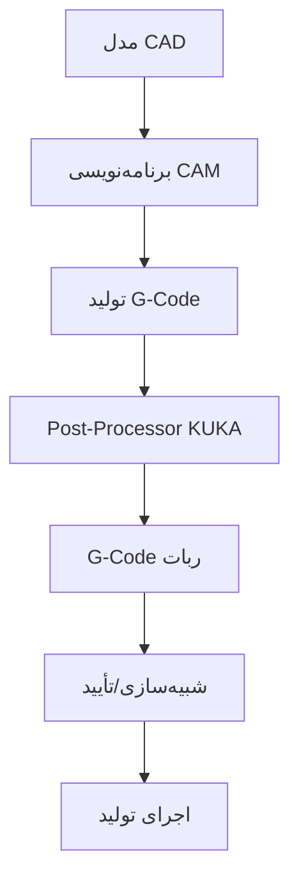

# راهنمای یکپارچگی ربات KUKA با CNC: از KRL به برنامه‌نویسی G-Code

## فهرست مطالب
1. [درک چشم‌انداز یکپارچگی](#درک-چشم‌انداز-یکپارچگی)
2. [مبانی زبان ربات KUKA (KRL)](#مبانی-زبان-ربات-kuka-krl)
3. [روش‌های یکپارچگی CNC](#روش‌های-یکپارچگی-cnc)
4. [بررسی عمیق فناوری KUKA.CNC](#بررسی-عمیق-فناوری-kukacnc)
5. [مراحل عملی پیاده‌سازی](#مراحل-عملی-پیاده‌سازی)
6. [نمونه کدها و تکنیک‌های برنامه‌نویسی](#نمونه-کدها-و-تکنیک‌های-برنامه‌نویسی)
7. [یکپارچگی نرم‌افزار CAM](#یکپارچگی-نرم‌افزار-cam)
8. [عیب‌یابی و بهینه‌سازی](#عیب‌یابی-و-بهینه‌سازی)
9. [تجزیه هزینه و بازگشت سرمایه](#تجزیه-هزینه-و-بازگشت-سرمایه)

---

## درک چشم‌انداز یکپارچگی

### چالش مهندسی
اگر شما مهندسی با تجربه ماشینکاری CNC هستید و به ربات‌های KUKA نگاه می‌کنید، با سوال اساسی مواجه هستید: "چگونه از دانش موجود G-code و CAM خود با زبان برنامه‌نویسی ربات KUKA (KRL) استفاده کنم؟"

پاسخ در درک سه رویکرد متمایز یکپارچگی نهفته است:
1. **ترجمه مستقیم**: تبدیل G-code به دستورات KRL
2. **یکپارچگی KUKA.CNC**: امکان اجرای مستقیم G-code روی کنترلرهای KUKA
3. **برنامه‌نویسی ترکیبی**: ترکیب منطق ربات KRL با دستورات حرکت سبک CNC

### چرا این موضوع برای کسب‌وکار شما مهم است
- **بهره‌گیری از مهارت‌های موجود**: تیم برنامه‌نویسی CNC شما سریع‌تر انتقال می‌یابد
- **استفاده مجدد از برنامه‌های CAM**: مسیرهای ابزار موجود قابل تطبیق با کاربردهای ربات هستند
- **پیاده‌سازی سریع‌تر**: منحنی یادگیری کمتر به معنای بازگشت سرمایه سریع‌تر
- **کنترل دقیق**: دقت سطح CNC برای کاربردهای رباتیک

---

## مبانی زبان ربات KUKA (KRL)

### KRL در زمینه: آنچه برنامه‌نویسان CNC باید بدانند

KRL را به عنوان "کد ماشین" ربات‌های KUKA در نظر بگیرید، مشابه نحوه‌ای که G-code پایه کنترل CNC است. با این حال، KRL در سطح بالاتری عمل می‌کند و نه تنها حرکت، بلکه موارد زیر را نیز مدیریت می‌کند:

- **سیستم‌های مختصات**: قاب‌های مختصات پایه، ابزار و کار
- **انواع حرکت**: PTP (نقطه به نقطه)، LIN (خطی)، CIRC (دایره‌ای)
- **کنترل I/O**: ورودی‌ها و خروجی‌های دیجیتال و آنالوگ
- **سیستم‌های ایمنی**: نظارت بر سرعت، محدودیت‌های فضای کاری
- **جریان برنامه**: حلقه‌ها، شرطی‌ها و زیربرنامه‌ها

### ساختار پایه KRL برای مهندسان CNC

```krl
DEF MainProgram()
    ; راه‌اندازی ربات
    BAS(#INITMOV, 0)

    ; تنظیم پارامترهای حرکت (مثل نرخ تغذیه در CNC)
    $VEL.CP = 0.2        ; 20% حداکثر سرعت
    $ACC.CP = 0.1        ; 10% حداکثر شتاب

    ; حرکت به موقعیت خانه (مثل G28 در CNC)
    PTP HOME Vel=100 %DEFAULT

    ; حرکت خطی (مثل G01 در CNC)
    LIN {X 100, Y 50, Z 200, A 0, B 0, C 0} C_DIS

    ; حرکت دایره‌ای (مثل G02/G03 در CNC)
    CIRC {X 150, Y 100, Z 200, A 0, B 0, C 0}, {X 200, Y 50, Z 200, A 0, B 0, C 0}

END
```

### تفاوت‌های کلیدی با برنامه‌نویسی G-Code

| مفهوم G-Code | معادل KRL | تفاوت کلیدی |
|----------------|----------------|----------------|
| G00 (سریع) | PTP | حرکت فضای مفصل |
| G01 (خطی) | LIN | حرکت خطی دکارتی |
| G02/G03 (قوس) | CIRC | نیاز به نقطه میانی |
| M03/M05 (اسپیندل) | $OUT[1]=TRUE/FALSE | کنترل خروجی دیجیتال |
| G54-G59 (آفست کار) | $BASE, $TOOL | سیستم‌های مختصات متعدد |
| F (نرخ تغذیه) | $VEL.CP | سرعت مسیر پیوسته |

---

## روش‌های یکپارچگی CNC

### روش 1: ترجمه مستقیم G-Code به KRL

**نحوه کار**: تبدیل برنامه‌های G-code موجود به دستورات معادل KRL با استفاده از نرم‌افزار ترجمه یا تبدیل دستی.

**مناسب برای**:
- عملیات ماشینکاری ساده
- مسیرهای ابزار 2.5D موجود
- پیاده‌سازی سریع مفهوم اولیه

**نمونه ترجمه**:
```gcode
; G-code اصلی
G00 X100 Y50 Z200    ; حرکت سریع به موقعیت
G01 X150 F500        ; حرکت تغذیه خطی
G02 X200 Y100 I25 J0 F500  ; قوس ساعتگرد
```

```krl
; معادل KRL
PTP {X 100, Y 50, Z 200, A 0, B 0, C 0} Vel=100 %DEFAULT
LIN {X 150, Y 50, Z 200, A 0, B 0, C 0} C_DIS
CIRC {X 175, Y 75, Z 200, A 0, B 0, C 0}, {X 200, Y 100, Z 200, A 0, B 0, C 0} C_DIS
```

**محدودیت‌ها**:
- ترجمه دستی وقت‌گیر است
- هندسه‌های پیچیده نیاز به تطبیق قابل توجه دارند
- کنترل جهت ابزار نیاز به برنامه‌نویسی اضافی دارد

### روش 2: یکپارچگی مستقیم KUKA.CNC

**نحوه کار**: فناوری KUKA.CNC امکان اجرای مستقیم G-code استاندارد ISO 6983 روی کنترلرهای KUKA را بدون ترجمه به KRL فراهم می‌کند.

**پیاده‌سازی فنی**:
```krl
; ساختار برنامه KUKA.CNC
DEF CNC_Program()
    ; راه‌اندازی حالت CNC
    CNC_INIT()

    ; بارگذاری برنامه G-code
    CNC_LOAD("PART_001.NC")

    ; اجرای برنامه CNC
    CNC_START()

    ; نظارت بر اجرا
    REPEAT
        WAIT FOR CNC_READY()
    UNTIL CNC_FINISHED()

END
```

**مزایا**:
- اجرای مستقیم G-code (سازگار با ISO 6983)
- یکپارچگی نرم‌افزار CAM
- جبران شعاع ابزار
- پشتیبانی چرخه‌های آماده
- مدیریت ابزارهای خواهر

**الزامات**:
- کنترلر KUKA KRC4 یا KRC5
- مجوز نرم‌افزار KUKA.CNC (€10,000-25,000)
- مدل‌های ربات سازگار (سری KR)

### روش 3: رویکرد برنامه‌نویسی ترکیبی

**نحوه کار**: ترکیب منطق اختصاصی ربات KRL با دستورات حرکت سبک CNC برای انعطاف‌پذیری بهینه.

```krl
DEF HybridWelding()
    ; راه‌اندازی اختصاصی ربات
    BAS(#INITMOV, 0)
    InitializeWeldingTorch()

    ; حرکت سبک CNC برای مسیر دقیق
    ExecuteGCodeSequence("WELD_PATH_001.NC")

    ; منطق ربات برای کنترل فرآیند
    IF WeldQualityOK() THEN
        MoveToNextPosition()
    ELSE
        ExecuteReworkSequence()
    ENDIF

END

DEF ExecuteGCodeSequence(FileName : CHAR[])
    ; تابع سفارشی برای تفسیر G-code در KRL
    ; پیاده‌سازی بسته به الزامات خاص
END
```

---

## بررسی عمیق فناوری KUKA.CNC

### نمای کلی معماری

KUKA.CNC یک هسته NC کامل را در کنترلر ربات KUKA یکپارچه می‌کند و امکانات زیر را فراهم می‌آورد:

1. **پردازش مستقیم G-Code**: بدون نیاز به تبدیل به KRL
2. **اجرای زمان واقعی**: زمان‌بندی و دقت سطح CNC
3. **یکپارچگی CAM**: اتصال مستقیم به سیستم‌های CAD/CAM
4. **مدیریت ابزار**: تعویض خودکار ابزار و جبران

### اجزای سیستم

#### یکپارچگی هسته NC
- **پردازش**: تفسیر مستقیم G-code استاندارد ISO 6983
- **کنترل حرکت**: الگوریتم‌های interpolation سبک CNC
- **سیستم‌های مختصات**: سیستم‌های مختصات کار متعدد (G54-G59)
- **جبران ابزار**: جبران شعاع و طول

#### الزامات کنترلر
```krl
; پیکربندی سیستم KUKA.CNC
GLOBAL CHAR G_CODE_PROGRAM[256] = "PART_PROGRAM.NC"
GLOBAL REAL SPINDLE_SPEED = 1000.0
GLOBAL INT TOOL_NUMBER = 1

DEF ConfigureCNC()
    ; تنظیم پارامترهای CNC
    $CNC_FEED_RATE = 500        ; mm/min
    $CNC_SPINDLE_SPEED = 1000   ; rpm
    $CNC_TOOL_NUMBER = 1        ; ابزار فعال

    ; پیکربندی سیستم‌های مختصات
    $CNC_G54 = {X 0, Y 0, Z 0, A 0, B 0, C 0}
    $CNC_G55 = {X 100, Y 100, Z 0, A 0, B 0, C 0}

END
```

### دستورات G-Code پشتیبانی شده

#### دستورات حرکت
- **G00**: موقعیت‌یابی سریع
- **G01**: interpolation خطی
- **G02/G03**: interpolation دایره‌ای (ساعتگرد/خلاف ساعتگرد)
- **G04**: توقف/مکث

#### دستورات سیستم مختصات
- **G54-G59**: سیستم‌های مختصات کار
- **G90/G91**: موقعیت‌یابی مطلق/نسبی
- **G43**: جبران طول ابزار

#### چرخه‌های آماده
- **G81**: چرخه سوراخکاری
- **G82**: سوراخکاری با توقف
- **G83**: چرخه سوراخکاری پک

### نمونه پیاده‌سازی: برنامه برش HDPE

```gcode
; برنامه G-code برای برش مخزن سپتیک HDPE
; برنامه: TANK_CUTTING.NC

O1000                    ; شماره برنامه
G21                      ; برنامه‌نویسی متریک
G90                      ; موقعیت‌یابی مطلق
G54                      ; سیستم مختصات کار
G00 Z50                  ; سریع به ارتفاع ایمن

; فراخوانی ابزار و شروع اسپیندل
T01 M06                  ; تعویض ابزار به ابزار برش
S1200 M03                ; شروع اسپیندل در 1200 RPM
G00 X0 Y0                ; موقعیت‌یابی به نقطه شروع
G00 Z5                   ; موقعیت بالای کار

; توالی برش
G01 Z-10 F300            ; برش فرو
G01 X100 F500            ; برش در امتداد محور X
G02 X150 Y50 I0 J50 F400 ; برش قوسی
G01 Y100                 ; برش خطی
G00 Z50                  ; عقب‌کشی

M05                      ; توقف اسپیندل
M30                      ; پایان برنامه
```

**پیاده‌سازی معادل KUKA.CNC**:
```krl
DEF ExecuteTankCutting()
    ; راه‌اندازی محیط CNC
    CNC_INIT()

    ; بارگذاری و تأیید برنامه G-code
    IF CNC_LOAD("TANK_CUTTING.NC") THEN
        ; تنظیم پارامترهای ایمنی
        $CNC_SAFE_HEIGHT = 50
        $CNC_MAX_FEEDRATE = 1000

        ; شروع اجرای برنامه
        CNC_START()

        ; نظارت بر اجرا
        REPEAT
            ; بررسی خطاها یا مداخله اپراتور
            IF $CNC_ERROR THEN
                HandleCNCError()
                EXIT
            ENDIF

            WAIT FOR $CNC_CYCLE_TIME = 10  ; چرخه 10 میلی‌ثانیه

        UNTIL $CNC_PROGRAM_FINISHED

        ; برنامه با موفقیت تکمیل شد
        LogProductionData()
    ELSE
        ; مدیریت خطای بارگذاری برنامه
        DisplayError("بارگذاری برنامه G-code ناموفق")
    ENDIF

END
```

---

## مراحل عملی پیاده‌سازی

### مرحله 1: ارزیابی سیستم و برنامه‌ریزی

#### تأیید الزامات سخت‌افزار
1. **بررسی سازگاری کنترلر**
   ```krl
   ; بررسی نسخه کنترلر
   IF $ROBNAME[] = "KRC4" OR $ROBNAME[] = "KRC5" THEN
       ; سازگار با KUKA.CNC
       $CNC_CAPABLE = TRUE
   ELSE
       $CNC_CAPABLE = FALSE
       DisplayError("کنترلر با KUKA.CNC سازگار نیست")
   ENDIF
   ```

2. **تأیید مدل ربات**
   - سری KR AGILUS: یکپارچگی کامل CNC
   - سری KR CYBERTECH: CNC با محدودیت‌ها
   - سری KR FORTEC: کاربردهای CNC سنگین

3. **برنامه‌ریزی مجوز نرم‌افزار**
   - مجوز پایه KUKA.CNC: €10,000-15,000
   - بسته یکپارچگی CAM: €5,000-10,000
   - ویژگی‌های پیشرفته (5 محور): €8,000-12,000

### مرحله 2: پیکربندی نرم‌افزار CAM

#### نمونه یکپارچگی Fusion 360
```krl
; پیکربندی برای post-processor Fusion 360
DEF ConfigureFusion360()
    ; تنظیم پارامترهای اختصاصی KUKA
    $CAM_SYSTEM = "FUSION360"
    $POST_PROCESSOR = "KUKA_CNC_V2.1"

    ; پیکربندی پارامترهای حرکت
    $CAM_RAPID_FEED = 10000      ; mm/min
    $CAM_CUTTING_FEED = 500      ; mm/min
    $CAM_PLUNGE_FEED = 200       ; mm/min

    ; کنترل جهت ابزار
    $CAM_TOOL_ORIENTATION = "LEAD_FOLLOW"

END
```

#### راه‌اندازی Post-Processor
1. **دانلود post-processor KUKA** از پورتال مشتری KUKA
2. **نصب در نرم‌افزار CAM** (Fusion 360، Mastercam، PowerMill)
3. **پیکربندی پارامترهای ماشین**:
   - محدودیت‌های پوشش کاری
   - حداکثر نرخ تغذیه
   - محدودیت‌های جهت ابزار
   - نواحی ایمنی

### مرحله 3: گردکار توسعه برنامه

#### گردکار CNC سنتی به ربات CNC


#### نمونه عملی: برش پورت مخزن سپتیک
```krl
; برنامه کامل برای برش خودکار پورت
DEF CutTankPorts()
    ; راه‌اندازی برنامه
    InitializeRobot()
    InitializeCuttingTool()

    ; بارگذاری برنامه برش پورت از CAM
    IF CNC_LOAD("TANK_PORTS_300MM.NC") THEN
        ; تنظیم پارامترهای اختصاصی مواد
        ConfigureHDPECutting()

        ; اجرای توالی برش
        FOR PortNumber = 1 TO 4
            ; موقعیت‌یابی برای هر پورت
            MoveToPortPosition(PortNumber)

            ; اجرای برنامه برش CNC
            CNC_START()
            WaitForCompletion()

            ; بررسی کیفیت
            IF NOT CheckPortQuality() THEN
                ExecuteReworkSequence()
            ENDIF

        ENDFOR

        ; بازگشت به موقعیت خانه
        PTP HOME Vel=100 %DEFAULT

    ELSE
        HandleProgramLoadError()
    ENDIF

END

DEF ConfigureHDPECutting()
    ; پارامترهای برش اختصاصی HDPE
    $CNC_SPINDLE_SPEED = 800     ; RPM برای HDPE
    $CNC_FEED_RATE = 300         ; mm/min
    $CNC_COOLANT = FALSE         ; بدون خنک‌کننده برای HDPE

    ; تنظیمات اختصاصی ابزار
    $TOOL_DIAMETER = 6.0         ; فرز انتهایی 6 میلی‌متری
    $TOOL_LENGTH_OFFSET = 125.5  ; جبران طول ابزار

END
```

### مرحله 4: تست یکپارچگی و اعتبارسنجی

#### پروتکل توالی تست
```krl
DEF ValidateCNCIntegration()
    ; تست 1: تأیید حرکت پایه
    TestBasicMotion()

    ; تست 2: تأیید تجزیه G-code
    TestGCodeParsing()

    ; تست 3: تأیید جبران ابزار
    TestToolCompensation()

    ; تست 4: تست دقت تولید
    TestProductionAccuracy()

    ; تولید گزارش اعتبارسنجی
    GenerateValidationReport()

END

DEF TestProductionAccuracy()
    ; برش قطعه تست با ابعاد مشخص
    CNC_LOAD("ACCURACY_TEST.NC")
    CNC_START()
    WaitForCompletion()

    ; اندازه‌گیری نتایج
    MeasureTestPiece()

    ; اعتبارسنجی دقت در محدوده ±0.1mm
    IF $MEASURED_ACCURACY <= 0.1 THEN
        $ACCURACY_TEST_PASSED = TRUE
        LogMessage("تست دقت موفق")
    ELSE
        $ACCURACY_TEST_PASSED = FALSE
        LogMessage("تست دقت ناموفق - کالیبراسیون بررسی شود")
    ENDIF

END
```

---

## نمونه کدها و تکنیک‌های برنامه‌نویسی

### الگوهای برنامه‌نویسی پیشرفته

#### الگو 1: کنترل تطبیقی نرخ تغذیه
```krl
DEF AdaptiveFeedControl()
    ; نظارت بر نیروهای برش و تنظیم نرخ تغذیه
    REAL CurrentFeed, OptimalFeed, ForceLevel

    CurrentFeed = $CNC_FEED_RATE

    ; خواندن داده‌های سنسور نیرو
    ForceLevel = $TORQUE_AXIS[6]  ; نیروی محور Z

    ; الگوریتم تطبیقی
    IF ForceLevel > MAX_CUTTING_FORCE THEN
        ; کاهش نرخ تغذیه برای برش‌های سخت
        OptimalFeed = CurrentFeed * 0.8
    ELSE IF ForceLevel < MIN_CUTTING_FORCE THEN
        ; افزایش نرخ تغذیه برای برش‌های آسان
        OptimalFeed = CurrentFeed * 1.2
    ELSE
        ; حفظ نرخ تغذیه فعلی
        OptimalFeed = CurrentFeed
    ENDIF

    ; اعمال نرخ تغذیه جدید
    $CNC_FEED_RATE = OptimalFeed

    ; ثبت داده‌های بهینه‌سازی
    LogFeedOptimization(ForceLevel, OptimalFeed)

END
```

#### الگو 2: تعویض خودکار چند ابزار
```krl
DEF AutomaticToolChange(NewTool : INT)
    ; اطلاعات ابزار فعلی
    INT CurrentTool
    CurrentTool = $CNC_ACTIVE_TOOL

    IF NewTool <> CurrentTool THEN
        ; حرکت به موقعیت تعویض ابزار
        PTP $TOOL_CHANGE_POS Vel=100 %DEFAULT

        ; توقف اسپیندل در صورت فعال بودن
        IF $SPINDLE_RUNNING THEN
            $OUT[SPINDLE_ENABLE] = FALSE
            WAIT FOR NOT $SPINDLE_RUNNING
        ENDIF

        ; اجرای توالی تعویض ابزار
        ExecuteToolChange(CurrentTool, NewTool)

        ; به‌روزرسانی جبران ابزار
        $CNC_TOOL_LENGTH = TOOL_DATA[NewTool].LENGTH
        $CNC_TOOL_RADIUS = TOOL_DATA[NewTool].RADIUS

        ; تأیید تکمیل تعویض ابزار
        IF VerifyToolInstalled(NewTool) THEN
            $CNC_ACTIVE_TOOL = NewTool
            LogMessage("تعویض ابزار تکمیل شد: T" + NewTool)
        ELSE
            HandleToolChangeError()
        ENDIF

    ENDIF

END
```

#### الگو 3: نظارت کیفیت زمان واقعی
```krl
DEF QualityMonitoring()
    ; راه‌اندازی نظارت کیفیت
    REAL ToleranceLimit, MeasuredValue
    BOOL QualityOK

    ToleranceLimit = 0.05  ; تولرانس ±0.05mm

    ; نظارت مداوم در طول برش
    REPEAT
        ; خواندن داده‌های پروب یا سیستم بینایی
        MeasuredValue = GetCurrentMeasurement()

        ; بررسی در محدوده تولرانس
        IF ABS(MeasuredValue - NOMINAL_VALUE) <= ToleranceLimit THEN
            QualityOK = TRUE
        ELSE
            QualityOK = FALSE

            ; فعال‌سازی اقدام اصلاحی
            IF $CNC_PROGRAM_RUNNING THEN
                CNC_PAUSE()
                ExecuteCorrectiveAction()
                CNC_RESUME()
            ENDIF
        ENDIF

        ; ثبت داده‌های کیفیت
        LogQualityData(MeasuredValue, QualityOK)

        WAIT FOR $CYCLE_TIME = 50  ; بررسی هر 50 میلی‌ثانیه

    UNTIL NOT $CNC_PROGRAM_RUNNING

END
```

---

## یکپارچگی نرم‌افزار CAM

### پلتفرم‌های CAM پشتیبانی شده

#### یکپارچگی Fusion 360
```krl
; پیکربندی اختصاصی Fusion 360
DEF ConfigureFusion360Integration()
    ; تنظیم پارامترهای ارتباط
    $CAM_SOFTWARE = "FUSION360"
    $CAM_VERSION = "2025.1"
    $POST_PROCESSOR_VERSION = "KUKA_CNC_V3.0"

    ; پیکربندی پارامترهای ماشین
    $MACHINE_X_MIN = -1000
    $MACHINE_X_MAX = 1000
    $MACHINE_Y_MIN = -1000
    $MACHINE_Y_MAX = 1000
    $MACHINE_Z_MIN = -500
    $MACHINE_Z_MAX = 1500

    ; راه‌اندازی کتابخانه ابزار
    InitializeToolLibrary()

END
```

**مراحل راه‌اندازی Fusion 360**:
1. **دانلود post-processor KUKA** از کتابخانه ابری Autodesk
2. **پیکربندی تعریف ماشین**:
   - پوشش کاری ربات
   - محدودیت‌های جهت ابزار
   - هندسه برخورد
3. **راه‌اندازی استراتژی‌های مسیر ابزار**:
   - پاکسازی تطبیقی برای زبری
   - کانتور برای فینیش
   - استراتژی‌های سفارشی برای HDPE

#### یکپارچگی Mastercam
```krl
; پیکربندی اختصاصی Mastercam
DEF ConfigureMastercamIntegration()
    ; راه‌اندازی ارتباط Mastercam
    $CAM_SOFTWARE = "MASTERCAM"
    $CAM_VERSION = "2025"
    $POST_PROCESSOR = "KUKA_ROBOT_CNC.PST"

    ; پارامترهای ماشین اختصاصی ربات
    $ROBOT_MODEL = "KR_30_3"
    $CONTROLLER_TYPE = "KRC5"

    ; پیکربندی سیستم‌های مختصات
    SetupMastercamCoordinates()

END
```

### بهترین شیوه‌های برنامه‌نویسی CAM

#### بهینه‌سازی مسیر ابزار برای ربات‌ها
```krl
; توابع بهینه‌سازی مسیر ابزار
DEF OptimizeToolpath()
    ; به حداقل رساندن تغییرات جهت ابزار
    $TOOLPATH_SMOOTH_ANGLE = 5.0  ; درجه

    ; بهینه‌سازی نرخ تغذیه برای دینامیک ربات
    $RAPID_FEED_SCALE = 0.8       ; 80% حداکثر
    $CUTTING_FEED_SCALE = 0.6     ; 60% حداکثر

    ; اضافه کردن حرکات نزدیک شدن و دور شدن
    $APPROACH_DISTANCE = 10.0     ; mm
    $RETRACT_DISTANCE = 15.0      ; mm

    ; پیکربندی اجتناب از برخورد
    $COLLISION_CHECK = TRUE
    $SAFETY_MARGIN = 5.0          ; mm

END
```

#### برنامه‌نویسی اختصاصی مواد
```krl
; بهینه‌سازی برش HDPE
DEF OptimizeForHDPE()
    ; پارامترهای برش برای HDPE
    $SPINDLE_SPEED = 800          ; RPM
    $FEED_RATE = 400              ; mm/min
    $CHIP_LOAD = 0.1              ; mm/tooth

    ; انتخاب ابزار
    $RECOMMENDED_TOOL = "CARBIDE_END_MILL_6MM"
    $TOOL_GEOMETRY = "SHARP_EDGE"  ; برای برش تمیز HDPE

    ; استراتژی برش
    $CLIMB_MILLING = TRUE         ; فینیش سطح بهتر
    $STEP_DOWN = 3.0              ; mm در هر پاس
    $STEP_OVER = 3.0              ; mm بین پاس‌ها

END
```

---

## عیب‌یابی و بهینه‌سازی

### مشکلات رایج یکپارچگی

#### مشکل 1: مسائل سازگاری G-Code
```krl
DEF HandleGCodeCompatibility()
    ; بررسی G-code های پشتیبانی نشده
    CHAR UnsupportedCodes[] = "G73,G74,G76,G84,G85"

    IF DetectUnsupportedCode($CURRENT_GCODE_LINE) THEN
        ; ثبت هشدار و پیشنهاد جایگزین
        LogWarning("G-code پشتیبانی نشده شناسایی شد: " + $CURRENT_GCODE)
        SuggestAlternative($CURRENT_GCODE)

        ; توقف برای مداخله اپراتور
        CNC_PAUSE()
        DisplayMessage("سازگاری G-code بررسی شود")

    ENDIF

END
```

#### مشکل 2: محدودیت‌های جهت ابزار
```krl
DEF CheckToolOrientation()
    ; نظارت بر جهت ابزار در طول اجرا
    REAL CurrentA, CurrentB, CurrentC

    CurrentA = $AXIS_ACT[4]  ; زاویه محور A
    CurrentB = $AXIS_ACT[5]  ; زاویه محور B
    CurrentC = $AXIS_ACT[6]  ; زاویه محور C

    ; بررسی در برابر محدودیت‌های ربات
    IF (CurrentA > $A_AXIS_MAX) OR (CurrentA < $A_AXIS_MIN) THEN
        HandleOrientationLimit("A-axis")
    ENDIF

    IF (CurrentB > $B_AXIS_MAX) OR (CurrentB < $B_AXIS_MIN) THEN
        HandleOrientationLimit("B-axis")
    ENDIF

    ; پیشنهاد تغییرات مسیر ابزار
    IF OrientationLimitExceeded() THEN
        SuggestToolpathModification()
    ENDIF

END
```

### تکنیک‌های بهینه‌سازی عملکرد

#### بهینه‌سازی 1: ترکیب حرکت
```krl
DEF OptimizeMotionBlending()
    ; پیکربندی حرکت مسیر پیوسته
    $APO.CPTP = 50               ; درصد برای ترکیب PTP
    $APO.CDIS = 10               ; فاصله برای ترکیب LIN

    ; ترکیب تطبیقی بر اساس هندسه
    REAL GeometryComplexity
    GeometryComplexity = AnalyzeToolpath()

    IF GeometryComplexity > 0.8 THEN
        ; هندسه پیچیده - کاهش ترکیب
        $APO.CDIS = 5
    ELSE IF GeometryComplexity < 0.3 THEN
        ; هندسه ساده - افزایش ترکیب
        $APO.CDIS = 20
    ENDIF

    LogOptimization("ترکیب حرکت بهینه‌سازی شد")

END
```

#### بهینه‌سازی 2: تطبیق نرخ تغذیه
```krl
DEF AdaptFeedRates()
    ; تجزیه مسیر ابزار آینده
    REAL PathCurvature, OptimalFeed

    PathCurvature = AnalyzeCurvature($LOOKAHEAD_DISTANCE)

    ; تنظیم نرخ تغذیه بر اساس انحنای مسیر
    IF PathCurvature > HIGH_CURVATURE_THRESHOLD THEN
        OptimalFeed = $BASE_FEED_RATE * 0.6
    ELSE IF PathCurvature < LOW_CURVATURE_THRESHOLD THEN
        OptimalFeed = $BASE_FEED_RATE * 1.2
    ELSE
        OptimalFeed = $BASE_FEED_RATE
    ENDIF

    ; اعمال تغییرات تدریجی نرخ تغذیه
    GradualFeedChange(OptimalFeed)

END
```

### ابزارهای تشخیص و نظارت

#### نظارت عملکرد زمان واقعی
```krl
DEF MonitorPerformance()
    ; ردیابی معیارهای عملکرد
    REAL CycleTime, Efficiency, QualityScore

    ; محاسبه کارایی زمان چرخه
    CycleTime = $TIMER[1]
    Efficiency = (THEORETICAL_CYCLE_TIME / CycleTime) * 100

    ; نظارت بر معیارهای کیفیت
    QualityScore = CalculateQualityScore()

    ; ثبت داده‌های عملکرد
    LogPerformanceData(CycleTime, Efficiency, QualityScore)

    ; هشدار در صورت کاهش عملکرد
    IF Efficiency < MINIMUM_EFFICIENCY THEN
        AlertOperator("عملکرد زیر آستانه")
        SuggestOptimization()
    ENDIF

END
```

---

## تجزیه هزینه و بازگشت سرمایه

### تفکیک هزینه‌های پیاده‌سازی

#### هزینه‌های مجوز نرم‌افزار
- **مجوز پایه KUKA.CNC**: €10,000-15,000
- **بسته یکپارچگی CAM**: €5,000-10,000
- **ویژگی‌های پیشرفته (5 محور)**: €8,000-12,000
- **نگهداری سالانه**: €2,000-4,000
- **آموزش و گواهینامه**: €3,000-5,000

#### الزامات سخت‌افزار
- **ربات سازگار**: €40,000-80,000 (جدید) / €15,000-35,000 (کارکرده)
- **ارتقای کنترلر**: €5,000-15,000 (در صورت نیاز)
- **سیستم‌های ایمنی**: €5,000-10,000
- **نیروی کار یکپارچگی**: €10,000-25,000

#### محدوده کل سرمایه‌گذاری
- **پیاده‌سازی حداقل**: €50,000-75,000
- **راه‌اندازی حرفه‌ای**: €75,000-120,000
- **یکپارچگی پیشرفته**: €120,000-200,000

### تجزیه بازگشت سرمایه

#### افزایش بهره‌وری
```krl
; توابع محاسبه ROI
DEF CalculateROI()
    REAL ManualCycleTime, RobotCycleTime, LaborSavings
    REAL QualityImprovement, ThroughputIncrease

    ; صرفه‌جویی زمان
    ManualCycleTime = 45.0        ; دقیقه در هر قطعه
    RobotCycleTime = 12.0         ; دقیقه در هر قطعه
    LaborSavings = (ManualCycleTime - RobotCycleTime) / ManualCycleTime

    ; بهبود کیفیت
    QualityImprovement = 0.95     ; 95% کاهش نقص

    ; محاسبات توان عملیاتی
    ThroughputIncrease = ManualCycleTime / RobotCycleTime

    ; محاسبه صرفه‌جویی سالانه
    CalculateAnnualSavings(LaborSavings, QualityImprovement, ThroughputIncrease)

END
```

#### تجزیه دوره بازگشت سرمایه
- **صرفه‌جویی هزینه نیروی کار**: €60,000-100,000 سالانه
- **بهبود کیفیت**: €20,000-40,000 سالانه
- **افزایش توان عملیاتی**: €40,000-80,000 سالانه
- **کل مزایای سالانه**: €120,000-220,000
- **دوره بازگشت سرمایه معمول**: 12-18 ماه

### توجیه موردی کسب‌وکار

#### مزایای قابل اندازه‌گیری
1. **بهره‌وری**: 200-400% افزایش در نرخ تولید
2. **کیفیت**: 90-95% کاهش نرخ نقص
3. **ثبات**: 99%+ تکرارپذیری در مقابل تغییرات اپراتور
4. **نیروی کار**: 60-80% کاهش الزامات نیروی کار مستقیم
5. **ظرفیت**: قابلیت عملیات 24/7

#### مزایای استراتژیک
- **موقعیت‌یابی رقابتی**: قابلیت‌های تولید پیشرفته
- **مقیاس‌پذیری**: تکرار آسان در خطوط تولید
- **انعطاف‌پذیری**: تغییر سریع بین برنامه‌های قطعه
- **آینده‌نگری**: پلتفرم برای فناوری‌های تولید پیشرفته

---

## نتیجه‌گیری و مراحل بعدی

### نقشه راه پیاده‌سازی

#### فاز 1: اثبات مفهوم (ماه‌های 1-3)
1. **ارزیابی نرم‌افزار**: تست KUKA.CNC با برنامه‌های نمونه
2. **یکپارچگی CAM**: راه‌اندازی post-processor ها و گردکارها
3. **برنامه‌نویسی پایه**: توسعه کاربردهای برش ساده
4. **اعتبارسنجی ROI**: تأیید مزایای پیش‌بینی شده با تست آزمایشی

#### فاز 2: پیاده‌سازی تولید (ماه‌های 4-8)
1. **نصب سیستم**: استقرار سلول ربات تولید
2. **توسعه برنامه**: ایجاد برنامه‌های تولید کامل
3. **آموزش اپراتور**: توسعه شایستگی در برنامه‌نویسی ربات CNC
4. **بهینه‌سازی فرآیند**: تنظیم دقیق پارامترها برای حداکثر کارایی

#### فاز 3: مقیاس‌گذاری و بهینه‌سازی (ماه‌های 9-12)
1. **کاربردهای اضافی**: گسترش به فرآیندهای تولید دیگر
2. **ویژگی‌های پیشرفته**: پیاده‌سازی ماشینکاری 5 محور، کنترل تطبیقی
3. **بهبود یکپارچگی**: اتصال به سیستم‌های ERP و کیفیت
4. **بهبود مداوم**: بهینه‌سازی مداوم و گسترش قابلیت‌ها

### منابع پشتیبانی فنی

#### کانال‌های پشتیبانی KUKA
- **خط تلفن فنی**: +49 821 797-5555
- **پشتیبانی آنلاین**: my.kuka.com
- **مراکز آموزشی**: چندین موقعیت در سراسر اروپا
- **شرکای محلی**: یکپارچه‌سازان سیستم گواهی‌شده

#### پشتیبانی نرم‌افزار CAM
- **Fusion 360**: پشتیبانی Autodesk و انجمن‌های جامعه
- **Mastercam**: پشتیبانی و آموزش CNC Software
- **PowerMill**: پشتیبانی فنی Delcam/Autodesk

### معیارهای موفقیت و KPI ها

این شاخص‌های کلیدی عملکرد را برای اطمینان از پیاده‌سازی موفق نظارت کنید:

1. **کارایی برنامه‌نویسی**: زمان توسعه برنامه‌های جدید
2. **زمان چرخه**: نرخ تولید واقعی در مقابل نظری
3. **معیارهای کیفیت**: نرخ نقص و دقت ابعادی
4. **استفاده**: ساعات عملیاتی ربات و زمان خرابی
5. **دستیابی ROI**: مزایای مالی واقعی در مقابل پیش‌بینی شده

یکپارچگی ربات‌های KUKA با برنامه‌نویسی CNC ترکیب قدرتمندی از انعطاف‌پذیری رباتیک و دقت CNC را نمایندگی می‌کند. با پیروی از این راهنمای جامع، مهندسان می‌توانند تخصص CNC خود را با موفقیت به کاربردهای رباتیک پل بزنند و بهره‌وری و کیفیت برتری را در عین بهره‌گیری از مهارت‌ها و دانش موجود به دست آورند.

---

*این راهنما پایه‌ای برای یکپارچگی موفق KUKA-CNC فراهم می‌کند. برای پشتیبانی پیاده‌سازی خاص، با پشتیبانی فنی KUKA یا یکپارچه‌سازان سیستم گواهی‌شده در منطقه خود تماس بگیرید.*